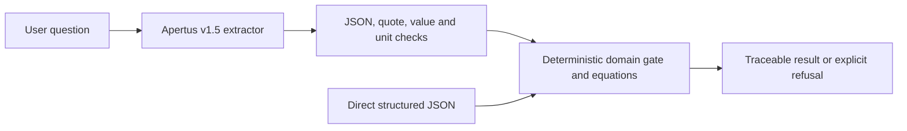

# Architecture and trust boundary

Only user-declared measurements may cross from the model into the solver. The model does not provide constants, equations, fluid properties or a final answer. `src/apertus_client.py` fails closed on missing credentials, transport errors, non-JSON output, missing fields, unsupported assumptions and quotes that do not appear in the user text. `src/flowguard.py` checks SI conversion, Reynolds number, entrance length and input uncertainty before emitting a number. It never reads or writes credential files.

The on-premise deployment requires an organization-managed Apertus inference server. The `LLM_BASE_URL` value must end at that server's OpenAI-compatible API root (typically `/v1`), not at `/chat/completions`; the client appends the latter. Remote hosts require HTTPS. The client error messages never include the URL, request body, response body or credential.
